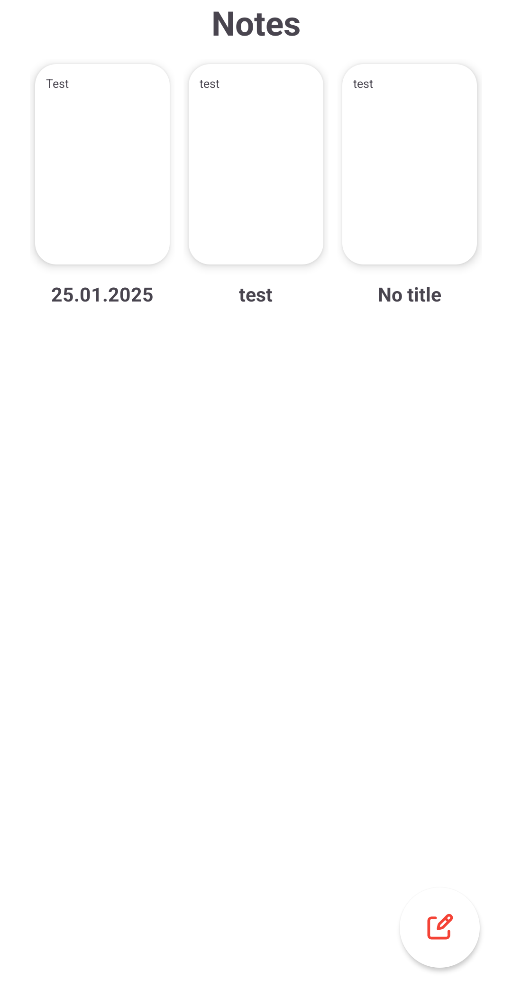

# Note App

Note App is an Android application designed to help users create, manage, and organize their notes efficiently. It provides a simple and user-friendly interface for a seamless note-taking experience.

## 📝 Features

- **Create, Edit, and Delete Notes** 🗒️
- **Grid Layout for Better Visualization** 📋
- **Efficient Storage with Room Database** 💾
- **Smooth Scrolling with RecyclerView** 🔄

## 🛠 Technologies Used

- **Room Database** for Persistent Storage 💾
- **RecyclerView with Grid Layout Manager** for Organized Display 📋
- **Modern Android UI Design** 🎨

## 📸 Screenshots

Below are some screenshots of the application:

<table>
  <tr>
    <td></td>
    <td></td>
  </tr>
</table>

## 🚀 Try the App

Download the APK and try it out.

---

**Author: Imotdinov Bunyodbek**  
**Contact: [imotdinovbunyodbek2@gmail.com](mailto:imotdinovbunyodbek2@gmail.com)
